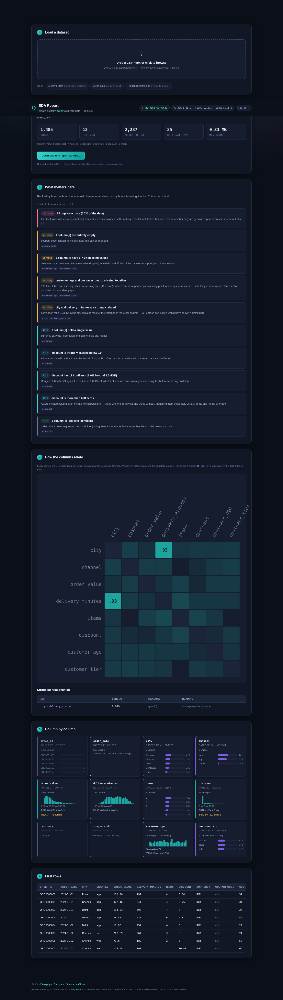
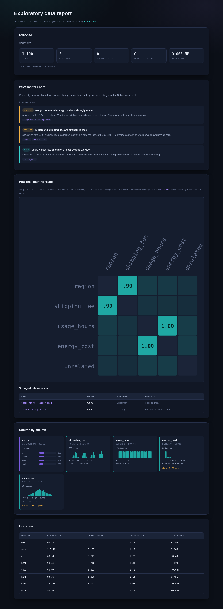

# EDA Report

**Drop in a CSV. Get a ranked list of what's actually wrong with it.**

[](https://devapriyan-s.github.io/eda-report/)
[](https://github.com/Devapriyan-S/eda-report/actions/workflows/tests.yml)
[](LICENSE)

### ▶ [**Open the live demo**](https://devapriyan-s.github.io/eda-report/)



---

Most auto-EDA tools hand you a wall of charts and a correlation heatmap, and
leave you to work out what matters. This one does the working-out: findings are
**ranked by how much they would change an analysis**, each stated as a fact plus
a sentence on the consequence.

> **✕ Critical — 85 duplicate rows (5.7% of the data).** Identical rows inflate
> every count and can leak across a train/test split, making a model look better
> than it is.
>
> **⚠ Warning — `customer_age` and `customer_tier` go missing together.** 100% of
> the rows missing either are missing both (380 rows). Values that disappear in
> pairs usually point to one upstream cause — a failed join or a skipped form
> section — not to two independent gaps.

## Relationships `df.corr()` cannot see

`df.corr()` speaks only Pearson, and Pearson speaks only numeric-to-numeric and
only sees straight lines. Two thirds of a typical dataset is invisible to it.

Every pair here is measured on a common **0–1 scale**:

| Pair type | Measure | What Pearson does |
|---|---|---|
| numeric ↔ numeric | **Spearman** rank correlation | misses curves |
| categorical ↔ categorical | **Cramér's V**, bias-corrected | cannot run at all |
| numeric ↔ categorical | **correlation ratio η** | cannot run at all |

On the built-in "Hidden relationships" sample:

- `region` ↔ `shipping_fee` scores **0.993** — knowing the region tells you the
  fee almost exactly. A Pearson correlation would have shown nothing, because
  one side is a category.
- `usage_hours` ↔ `energy_cost` scores **0.998** by Spearman. When the curve is
  steeper, the tool notes that Pearson is much lower and says *"monotone but
  curved — a linear model will underfit it."*

**Cramér's V is bias-corrected** (Bergsma), which matters more than it sounds:
the raw statistic reports ~0.7 between two *independent* columns with 30 levels
on 200 rows. Corrected, the same pair scores 0.03. There's a test for exactly
that.

## Download the whole thing as one file

One click produces a **self-contained HTML report** — styles inlined, SVG
inlined, no scripts, no network requests. 39 KB. It opens on a machine that has
never heard of this tool, which is what makes it something you can attach to an
email.



That export had a bug worth keeping in mind: serialising a CSS rule that mixes
the `background` shorthand with `background-image` emits `background-color: ;`
— an empty value, which invalidates the whole declaration. The downloaded
report rendered light text on a white page until an explicit background was
re-stated after the extracted rules.

## What it checks

- **Duplicates**, weighted by what fraction of the data they are
- **Missingness**, split into "impute this" and "this column is 90% empty, drop it", plus a row-wise `dropna()` cost estimate
- **Missingness patterns** — columns whose blanks coincide, by Jaccard overlap
- **Skew and outliers**, with the 1.5×IQR count and what to do about them
- **Zero-inflation** — a column that is more than half zeros usually contains two populations
- **Category imbalance** — a 95%-one-value column is nearly constant as a feature and makes accuracy meaningless as a target
- **Identifiers and constants**, so they don't quietly become model features
- **Column roles inferred from values**, not names: a bare `2019` is an integer, not a date; a rounded price is not a row index

Findings are sorted critical → warning → note → info. A clean dataset produces a
single line saying so, rather than manufacturing concerns.

## Run it

```bash
git clone https://github.com/Devapriyan-S/eda-report.git
cd eda-report
pip install -r requirements.txt

python tests/test_eda.py            # association measures + findings
python build.py                     # sync edakit -> web/py/
python -m http.server 8000 -d web   # open http://localhost:8000
```

As a library:

```python
import pandas as pd
from edakit import (profile_dataframe, association_matrix,
                    missingness_correlation, build_findings)

df = pd.read_csv("orders.csv")
profiles = profile_dataframe(df)

numeric     = [p["name"] for p in profiles if p["role"] == "numeric"]
categorical = [p["name"] for p in profiles if p["role"] == "categorical"]
_, matrix, pairs = association_matrix(df, numeric, categorical)

for f in build_findings(df, profiles, pairs, missingness_correlation(df)):
    print(f"[{f.severity}] {f.title}\n    {f.detail}")
```

## Limits

- **Pairwise associations are O(columns²)**, with a chi-square or ANOVA per
  pair. Above 30 comparable columns the matrix keeps only the highest-variation
  ones and says how many it dropped.
- **Association is not causation, and not conditional.** Two columns can look
  related purely through a third. Nothing here controls for that.
- **No time-awareness.** Datetime columns are profiled but not tested for trend
  or seasonality — that's [timeseries-forecaster](https://github.com/Devapriyan-S/timeseries-forecaster).
- **Text columns get counts, not NLP.** No topic modelling or sentiment.
- **The whole file is loaded into memory.** Comfortable to a few hundred MB in
  a browser tab; beyond that, use the library server-side.

---

MIT licensed. Built by [Devapriyan Sampath](https://github.com/Devapriyan-S).
